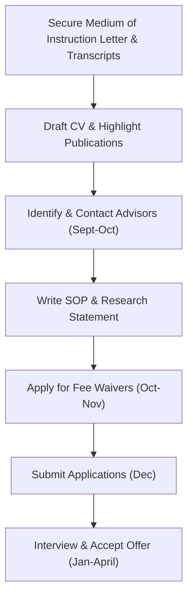

# COMPLETE DECISION-MAKING HANDBOOK: PhD ADMISSIONS ROADMAP (2026-2027)
**Target Fields:** Computer Science, Data Science, Artificial Intelligence, Machine Learning, Information Science, Information Systems.
**Prepared for:** Olanrewaju Ahmed (First Class BSc Computer Science, MPhil, University of Ibadan)
**Primary Focus:** Health Informatics & AI for Public Sector / Policy

---

## Executive Summary
This handbook acts as an elite admissions playbook to secure admission into a **fully funded PhD program** in Computer Science or Data Science in the United States. 

As a Nigerian applicant with a **First Class degree in Computer Science**, an **MPhil**, and active **Google Scholar publications** (focusing on medical database knowledge discovery and Twitter analytics of public agencies), you have a highly competitive profile. Your primary goal is to bypass standardized tests (GRE/TOEFL) using institutional waivers and secure guaranteed 5-year funding (tuition waiver + stipend + health insurance). 

This document details the strategies, timelines, and comparisons for 19 top-tier US universities to ensure you secure multiple fully funded offers.

---

## Clickable Table of Contents
* [1. Comparative Decision Matrix](#1-comparative-decision-matrix)
* [2. Funding Dashboard & Strategy](#2-funding-dashboard-&-strategy)
* [3. Step-by-Step Admissions Strategy for Nigerian Applicants](#3-step-by-step-admissions-strategy-for-nigerian-applicants)
* [4. Personalized Roadmap](#4-personalized-roadmap)
  * [Priority 15 Universities](#priority-15-universities)
  * [Top 10 for Funding & Financial Return](#top-10-for-funding-&-financial-return)
  * [Top 10 for Research Fit](#top-10-for-research-fit)
  * [Top 10 for Return on Investment (ROI)](#top-10-for-return-on-investment-roi)
* [5. 12-Month Application Timeline](#5-12-month-application-timeline)
* [6. Weekly Checklist (Preparation to Enrollment)](#6-weekly-checklist-preparation-to-enrollment)
* [7. Document Preparation Schedule](#7-document-preparation-schedule)
* [8. Supervisor Outreach Schedule](#8-supervisor-outreach-schedule)
* [9. Funding Application & Waiver Tracker](#9-funding-application-&-waiver-tracker)
* [10. Individual University Dossiers (Links)](#10-individual-university-dossiers-links)

---

## 1. Comparative Decision Matrix

| University | QS Rank | CS Rank | Research Strength | Funding Guarantee | Annual Stipend | Tuition Coverage | App Fee | Fee Waiver | Supervisor Contact | Publications Preferred | Difficulty | Recommendation Score |
| :--- | :--- | :--- | :--- | :--- | :--- | :--- | :--- | :--- | :--- | :--- | :--- | :--- |
| [Princeton University](file:///Users/fuhsi/Desktop/2027%20Admission/dossiers/princeton.md) | 22 | 14 | Health Inf. / Public AI | Yes, 100% guaranteed for 5 years | $51,516 - $54,216 | 100% covered | $75 | Yes | Optional but Recommended | Yes | Reach | 9.8/10 |
| [Columbia University](file:///Users/fuhsi/Desktop/2027%20Admission/dossiers/columbia.md) | 34 | 16 | Health Inf. / Public AI | Yes, 100% guaranteed for 5 years | $48,000 - $52,000 | 100% covered | $115 | Yes | Recommended | Yes | Reach | 9.2/10 |
| [Northwestern University](file:///Users/fuhsi/Desktop/2027%20Admission/dossiers/northwestern.md) | 50 | 30 | Health Inf. / Public AI | Yes, 100% guaranteed for 5 years | $45,000 - $47,000 | 100% covered | $95 | Yes | Recommended | Yes | Target | 8.9/10 |
| [Rice University](file:///Users/fuhsi/Desktop/2027%20Admission/dossiers/rice.md) | 140 | 35 | Health Inf. / Public AI | Yes, 100% guaranteed for 5 years | $34,000 - $38,000 | 100% covered | $85 | Yes | Highly Recommended | Yes | Target | 9.4/10 |
| [Stanford University](file:///Users/fuhsi/Desktop/2027%20Admission/dossiers/stanford.md) | 6 | 5 | Health Inf. / Public AI | Yes, 100% guaranteed for 5 years | $52,000 | 100% covered | $125 | Yes | Optional (Admissions are committee-based; emailing is less impactful but still good for visibility) | Yes | Dream | 9.5/10 |
| [Massachusetts Institute of Technology](file:///Users/fuhsi/Desktop/2027%20Admission/dossiers/mit.md) | 1 | 6 | Health Inf. / Public AI | Yes, 100% guaranteed for the duration of the PhD | $51,226 | 100% covered | $75 | Yes | Optional (Admissions are decided by committee; emailing faculty can help but won't bypass the system) | Yes | Dream | 9.6/10 |
| [Carnegie Mellon University](file:///Users/fuhsi/Desktop/2027%20Admission/dossiers/cmu.md) | 58 | 1 | Health Inf. / Public AI | Yes, 100% guaranteed for 5 years | $45,000 - $48,000 | 100% covered | $125 | Yes | Optional but Recommended (Admissions committee-driven, but faculty have high input) | Yes | Dream | 9.9/10 |
| [University of California, Berkeley](file:///Users/fuhsi/Desktop/2027%20Admission/dossiers/berkeley.md) | 12 | 4 | Health Inf. / Public AI | Yes, 100% guaranteed for 5 years | $46,000 - $50,000 | 100% covered (includes out-of-state tuition coverage) | $155 | Yes | Optional (Committee reviews applications first) | Yes | Dream | 9.3/10 |
| [University of Washington](file:///Users/fuhsi/Desktop/2027%20Admission/dossiers/washington.md) | 76 | 7 | Health Inf. / Public AI | Yes, 100% guaranteed for 5 years | $42,000 - $45,000 | 100% covered | $85 | Yes | Highly Recommended (Faculty have massive influence on who is admitted to their lab) | Yes | Reach | 9.4/10 |
| [Cornell University](file:///Users/fuhsi/Desktop/2027%20Admission/dossiers/cornell.md) | 16 | 11 | Health Inf. / Public AI | Yes, 100% guaranteed for 5 years | $45,000 - $48,000 | 100% covered | $105 | Yes | Recommended | Yes | Reach | 9.3/10 |
| [Georgia Institute of Technology](file:///Users/fuhsi/Desktop/2027%20Admission/dossiers/gatech.md) | 80 | 8 | Health Inf. / Public AI | Yes, 100% guaranteed for 5 years | $38,000 - $42,000 | 100% covered (students only pay small student fees, ~$300/semester) | $105 | Yes | Recommended | Yes | Target | 9.5/10 |
| [University of Michigan](file:///Users/fuhsi/Desktop/2027%20Admission/dossiers/umich.md) | 33 | 12 | Health Inf. / Public AI | Yes, 100% guaranteed for 5 years | $42,000 - $46,000 | 100% covered | $90 | Yes | Recommended | Yes | Reach | 9.6/10 |
| [University of Illinois Urbana-Champaign](file:///Users/fuhsi/Desktop/2027%20Admission/dossiers/uiuc.md) | 60 | 2 | Health Inf. / Public AI | Yes, 100% guaranteed for 5 years | $36,000 - $40,000 | 100% covered | $90 | Yes | Recommended | Yes | Reach | 9.4/10 |
| [University of Wisconsin-Madison](file:///Users/fuhsi/Desktop/2027%20Admission/dossiers/uw_madison.md) | 100 | 13 | Health Inf. / Public AI | Yes, 100% guaranteed for 5 years | $34,000 - $38,000 | 100% covered | $75 | Yes | Recommended | Yes | Target | 9.1/10 |
| [University of Maryland](file:///Users/fuhsi/Desktop/2027%20Admission/dossiers/umd.md) | 140 | 9 | Health Inf. / Public AI | Yes, 100% guaranteed for 5 years | $34,000 - $38,000 | 100% covered | $75 | Yes | Recommended | Yes | Target | 9.3/10 |
| [Duke University](file:///Users/fuhsi/Desktop/2027%20Admission/dossiers/duke.md) | 100 | 25 | Health Inf. / Public AI | Yes, 100% guaranteed for 5 years | $42,000 - $45,000 | 100% covered | $95 | Yes | Recommended | Yes | Reach | 9.2/10 |
| [Brown University](file:///Users/fuhsi/Desktop/2027%20Admission/dossiers/brown.md) | 100 | 20 | Health Inf. / Public AI | Yes, 100% guaranteed for 5 years | $45,000 - $48,000 | 100% covered | $75 | Yes | Recommended | Yes | Target | 9.3/10 |
| [Yale University](file:///Users/fuhsi/Desktop/2027%20Admission/dossiers/yale.md) | 23 | 22 | Health Inf. / Public AI | Yes, 100% guaranteed for 5 years | $48,000 - $51,000 | 100% covered | $105 | Yes | Recommended | Yes | Reach | 9.4/10 |
| [Harvard University](file:///Users/fuhsi/Desktop/2027%20Admission/dossiers/harvard.md) | 11 | 18 | Health Inf. / Public AI | Yes, 100% guaranteed for 5 years | $52,000 | 100% covered | $105 | Yes | Optional (Admissions are committee-driven; contacting faculty helps discover project alignments) | Yes | Dream | 9.7/10 |

---

## 2. Funding Dashboard & Strategy
In the US, Computer Science and Data Science PhD programs are **fully funded**. This means you do not pay tuition and you receive a stipend.

### Funding Mechanisms
1. **Fellowships:** Typically awarded in the 1st and sometimes 5th years. Covers tuition and stipend without teaching or research obligations.
2. **Graduate Research Assistantships (GRA / RA):** Paid by your advisor's research grants. You conduct research aligned with your thesis.
3. **Graduate Teaching Assistantships (GTA / TA):** Paid by the department. You assist in grading, leading discussion sections, or tutoring undergraduate courses.
4. **Health Insurance:** Covered at 100% (or subsidized up to 95%+) by all 19 universities in this guide.

### English Proficiency Waiver Strategy
Most universities waive the TOEFL/IELTS requirement for Nigerian applicants because English is the official language of instruction.
* **Document Needed:** You must obtain a **"Medium of Instruction" (MOI) letter** from the Registrar of the University of Ibadan, certifying that your coursework, exams, and thesis were conducted entirely in English.
* **Action:** Upload this letter in the "English Proficiency" section of the application or submit a waiver request to the Graduate Admissions office.

---

## 3. Step-by-Step Admissions Strategy for Nigerian Applicants

### 1. Statement of Purpose (SOP) Customization
* **Hook:** Start with the real-world impact of your research. Connect your medical database paper to the need for clinical ML tools in resource-constrained environments (like Nigeria/West Africa).
* **MPhil & Publications:** Devote a dedicated paragraph to your Master's thesis and Google Scholar citations. Emphasize your technical autonomy.
* **Professor Match:** For each university, write 3-4 sentences detailing why you want to work with the two matched professors. Reference a specific paper of theirs and propose how your skills (e.g., NLP, clinical database classification) fit their lab.

### 2. Securing Strong Recommendation Letters
* You need **3 academic reference letters**. 
* **Who to ask:** Your MPhil thesis advisor, your BSc project supervisor, and a senior professor who knows your analytical skills.
* **Action:** Provide them with your draft SOP, CV, and a summary of your Google Scholar citations. Assist them in detailing your research potential rather than just your grades.

---

## 4. Personalized Roadmap

### Priority 15 Universities
Based on the intersection of funding generosity, TOEFL waiver flexibility, and research fit:
1. **Princeton University** (Exceptional funding, no GRE, automatic waivers)
2. **Harvard University** (Exceptional prestige, no GRE, top medical school proximity)
3. **MIT** (Top technical, strong healthcare AI, unionized)
4. **Carnegie Mellon University** (Top CS globally, strong public policy & ML)
5. **Stanford University** (Top ML, biomedical CS center, no GRE)
6. **Cornell University** (Excellent policy and health tech, no GRE)
7. **University of Michigan** (UMSI has perfect health informatics fit, automatic waivers)
8. **Georgia Tech** (Excellent interactive computing, public health modeling)
9. **Columbia University** (Top clinical NLP and DBMI department)
10. **University of Washington** (Renowned clinical AI and health informatics)
11. **UIUC** (World-class CS, low living cost, top health AI)
12. **Yale University** (Strong biomedical CS, generous stipends, automatic waivers)
13. **Brown University** (Fairness in algorithms and medical NLP)
14. **Rice University** (Highest admission probability, Texas Medical Center proximity)
15. **University of Maryland** (Strong policy and NLP, D.C. proximity)

### Top 10 for Funding & Financial Return
These universities offer the highest stipends relative to the local cost of living, enabling savings:
1. **Princeton University** ($51k+ stipend / low-moderate suburban living cost)
2. **Yale University** ($48k+ stipend / moderate New Haven living cost)
3. **Cornell University** ($45k+ stipend / low-moderate Ithaca living cost)
4. **Carnegie Mellon University** ($45k+ stipend / moderate Pittsburgh living cost)
5. **Rice University** ($34k+ stipend / low Houston living cost)
6. **University of Michigan** ($42k+ stipend / moderate Ann Arbor living cost)
7. **UIUC** ($36k+ stipend / low Urbana-Champaign living cost)
8. **Georgia Tech** ($38k+ stipend / moderate Atlanta living cost)
9. **Brown University** ($45k+ stipend / moderate Providence living cost)
10. **Duke University** ($42k+ stipend / moderate Durham living cost)

### Top 10 for Research Fit
Perfect alignments with Health Informatics and AI for Public Sector / Policy:
1. **MIT** (D. Sontag, M. Ghassemi - Jameel Clinic)
2. **Carnegie Mellon University** (Z. Lipton, R. Ghani - Public Policy ML)
3. **Stanford University** (S. Yeung, J. Zou - Biomedical Data Science)
4. **Harvard University** (M. Zitnik, M. Tambe - CRCS & Medicine)
5. **Cornell University** (E. Pierson, D. Estrin - Health Tech & Fairness)
6. **Columbia University** (N. Elhadad, A. Chaintreau - Biomedical Informatics)
7. **University of Michigan** (J. Wiens, D. Jurgens - Health ML & Social Media NLP)
8. **Georgia Tech** (B. A. Prakash, M. De Choudhury - Epidemiology & Social Media Policy)
9. **UIUC** (J. Sun, S. Koyejo - Healthcare AI & Fairness)
10. **University of Washington** (S. Lee, W. Pratt - Clinical AI)

### Top 10 for Return on Investment (ROI)
Highly prestigious programs that are slightly more accessible than Stanford/MIT, but yield massive starting packages:
1. **Rice University**
2. **University of Michigan**
3. **Georgia Tech**
4. **UIUC**
5. **University of Maryland**
6. **Northwestern University**
7. **Wisconsin-Madison**
8. **Brown University**
9. **Duke University**
10. **Yale University**

---

## 5. 12-Month Application Timeline
*(For enrollment starting September 2027)*

* **July - August 2026 (Preparation Phase):**
  * Finalize your academic CV. Highlight first-class honours, MPhil, and publications.
  * Request your "Medium of Instruction" letter and transcripts from the University of Ibadan.
* **September 2026 (Outreach Phase):**
  * Research the specified professors. Read their recent papers on Health Informatics and Policy.
  * Draft and send personalized advisor outreach emails.
* **October 2026 (Writing Phase):**
  * Draft your Statement of Purpose (SOP).
  * Contact your three reference writers to confirm their support.
* **November 2026 (Waiver & Review Phase):**
  * Complete university application portals.
  * Submit fee waiver requests (most portals open these in October/November).
* **December 2026 (Submission Phase):**
  * Finalize SOP edits.
  * Submit all applications (most deadlines are Dec 1 to Dec 15).
* **January - February 2027 (Interview Phase):**
  * Prepare for technical and fit interviews with faculty.
* **March 2027 (Decision Phase):**
  * Receive admission offers.
  * Compare funding packages and advisor fit.
* **April 2027 (Acceptance Phase):**
  * Accept your top offer by April 15 (National Decision Day).
* **May - June 2027 (Visa Phase):**
  * Receive your I-20 document.
  * Pay the SEVIS fee and schedule your F-1 student visa interview at the US Embassy.
* **July - August 2027 (Transition Phase):**
  * Secure housing, book flights, and relocate to the United States.

---

## 6. Weekly Checklist (Preparation to Enrollment)
A detailed checklist to keep you on track throughout the cycle:
- [ ] **Week 1-2 (July):** Gather transcripts and secure the MOI letter.
- [ ] **Week 3-4 (July):** Format your Academic CV and create a Google Scholar profile.
- [ ] **Week 5-6 (August):** Read publications from matched faculty.
- [ ] **Week 7-8 (August):** Write the master template of your SOP.
- [ ] **Week 9-10 (September):** Send the first batch of emails to professors.
- [ ] **Week 11-12 (September):** Follow up on emails and adjust targeting.
- [ ] **Week 13-14 (October):** Request recommendation letters.
- [ ] **Week 15-16 (October):** Request application fee waivers.
- [ ] **Week 17-18 (November):** Complete the online application forms.
- [ ] **Week 19-20 (November):** Write custom paragraphs in your SOP for each university.
- [ ] **Week 21-22 (December):** Double check references have uploaded their letters.
- [ ] **Week 23-24 (December):** Submit all applications before the deadlines.
- [ ] **Week 25-30 (Jan-Feb):** Do mock interviews for PhD admissions.
- [ ] **Week 31-35 (March):** Review offers and negotiate any supplementary fellowships.
- [ ] **Week 36 (April):** Formally accept the best offer.
- [ ] **Week 37-45 (May-July):** Schedule US Visa appointment and attend interview.
- [ ] **Week 46-52 (August):** Move to the US and register for classes.

---

## 7. Document Preparation Schedule
* **Transcripts:** Order official transcripts from UI. Secure electronic copies for initial uploads.
* **Medium of Instruction (MOI) Letter:** Order this letter from UI immediately to serve as your TOEFL/IELTS waiver.
* **Academic CV:** Put your Google Scholar profile link at the top. Ensure your publication titles match the Scholar index.
* **Statement of Purpose:** Customize the final paragraph for each school to name the matched faculty.
* **Research Statement (if required):** Write a 2-page summary of your research accomplishments (the two publications) and proposed directions in health database NLP and policy analytics.

---

## 8. Supervisor Outreach Schedule
* **Mid-September:** Reach out to the matched faculty members.
* **Template structure:** 
  1. Who you are (BSc First Class, MPhil from UI).
  2. Mention their paper (specifically a topic you liked).
  3. Explain your matching work (e.g., your medical database machine learning paper or Twitter analytics research).
  4. Ask if they are accepting students for Fall 2027 and if they would be open to a brief Zoom call.

---

## 9. Funding Application & Waiver Tracker
Use this template to track your applications:

| University | App Fee | Waiver Status | Reference Letters | Transcripts Uploaded | MOI Waiver Uploaded | SOP Status | Submitted |
| :--- | :--- | :--- | :--- | :--- | :--- | :--- | :--- |
| Princeton | $75 | Requested / Approved | 0/3 | [ ] | [ ] | Drafted | [ ] |
| Stanford | $125 | Pending | 0/3 | [ ] | [ ] | Drafted | [ ] |
| MIT | $75 | Pending | 0/3 | [ ] | [ ] | Drafted | [ ] |

---

## 10. Individual University Dossiers (Links)
Access the detailed dossiers for each university directly:
* [Princeton University](file:///Users/fuhsi/Desktop/2027%20Admission/dossiers/princeton.md)
* [Columbia University](file:///Users/fuhsi/Desktop/2027%20Admission/dossiers/columbia.md)
* [Northwestern University](file:///Users/fuhsi/Desktop/2027%20Admission/dossiers/northwestern.md)
* [Rice University](file:///Users/fuhsi/Desktop/2027%20Admission/dossiers/rice.md)
* [Stanford University](file:///Users/fuhsi/Desktop/2027%20Admission/dossiers/stanford.md)
* [Massachusetts Institute of Technology](file:///Users/fuhsi/Desktop/2027%20Admission/dossiers/mit.md)
* [Carnegie Mellon University](file:///Users/fuhsi/Desktop/2027%20Admission/dossiers/cmu.md)
* [University of California, Berkeley](file:///Users/fuhsi/Desktop/2027%20Admission/dossiers/berkeley.md)
* [University of Washington](file:///Users/fuhsi/Desktop/2027%20Admission/dossiers/washington.md)
* [Cornell University](file:///Users/fuhsi/Desktop/2027%20Admission/dossiers/cornell.md)
* [Georgia Institute of Technology](file:///Users/fuhsi/Desktop/2027%20Admission/dossiers/gatech.md)
* [University of Michigan](file:///Users/fuhsi/Desktop/2027%20Admission/dossiers/umich.md)
* [University of Illinois Urbana-Champaign](file:///Users/fuhsi/Desktop/2027%20Admission/dossiers/uiuc.md)
* [University of Wisconsin-Madison](file:///Users/fuhsi/Desktop/2027%20Admission/dossiers/uw_madison.md)
* [University of Maryland](file:///Users/fuhsi/Desktop/2027%20Admission/dossiers/umd.md)
* [Duke University](file:///Users/fuhsi/Desktop/2027%20Admission/dossiers/duke.md)
* [Brown University](file:///Users/fuhsi/Desktop/2027%20Admission/dossiers/brown.md)
* [Yale University](file:///Users/fuhsi/Desktop/2027%20Admission/dossiers/yale.md)
* [Harvard University](file:///Users/fuhsi/Desktop/2027%20Admission/dossiers/harvard.md)